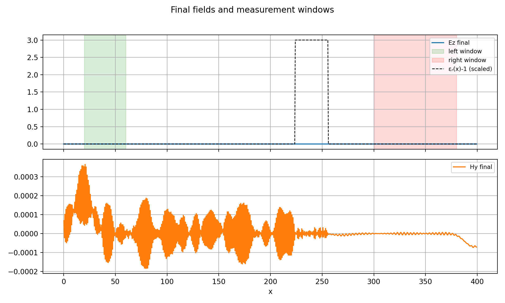

# 1D-FDTD-Demonstrator

## **Abstract**

**Title:**  
**1D Finite-Difference Time-Domain (FDTD) Demonstrator for Electromagnetic Wave Propagation and Scattering Analysis**

**Abstract:**  
We present a compact, self-contained Python implementation of the one-dimensional Finite-Difference Time-Domain (FDTD) method for simulating electromagnetic wave propagation in inhomogeneous media. The demonstrator models the interaction of a Gaussian-pulsed transverse electromagnetic (TEM) wave with a dielectric slab of finite thickness, embedded in free space. The computational domain employs a staggered Yee grid with normalized physical constants, and time-stepping is performed under the Courant stability criterion. Perfectly matched layers are replaced with first-order Mur absorbing boundary conditions to minimize reflections at the domain edges.  

The simulation records field snapshots at selected time steps, generates a high-resolution animation of wave evolution, and computes integrated field energy in predefined spatial windows to estimate reflection and transmission coefficients. Visualization outputs include electric and magnetic field profiles, spatial permittivity distribution, and energy bar charts. The code is optimized for clarity and reproducibility, requiring only standard Python scientific libraries (`NumPy`, `Matplotlib`). This demonstrator serves as both an educational tool for understanding FDTD fundamentals and a baseline for extending to higher-dimensional or more complex electromagnetic problems.

# 1D FDTD Demonstrator 

## Overview
This project implements a **one-dimensional Finite-Difference Time-Domain (FDTD)** simulation of electromagnetic wave propagation.

It models a Gaussian-pulsed wave interacting with a dielectric slab, computes reflection/transmission estimates, and produces both static figures and animations.

The code is designed for:
- **Educational purposes** — illustrating FDTD fundamentals
- **Research prototyping** — serving as a baseline for more complex simulations
- **Portfolio demonstration** — clean, reproducible, and visually compelling

## Features
- **Yee staggered grid** for `Ez` (electric) and `Hy` (magnetic) fields
- **Gaussian pulse source** injection
- **Dielectric slab** with adjustable position, width, and permittivity
- **Mur absorbing boundaries** to reduce edge reflections
- **Energy analysis** for reflection and transmission
- **Automated visualization**:
  - Field snapshots at selected time steps
  - Final field distribution with measurement windows
  - Animated wave propagation (`.mp4` and `.gif`)
  - Energy bar chart

## Requirements
- Python 3.x
- NumPy
- Matplotlib
- FFmpeg (for `.mp4` animation export)
- Pillow (for `.gif` animation export)

Install dependencies:

pip install numpy matplotlib pillow

Ensure FFmpeg is installed and available in your system PATH.

## How It Works
1. **Domain Setup**  
   - Grid length: `Nx` points, spacing `dx`  
   - Time step `dt` chosen via Courant stability factor `S`
2. **Material Definition**  
   - Relative permittivity array `eps_r`  
   - Dielectric slab inserted at a specified location
3. **Source Injection**  
   - Gaussian pulse at `src_pos`
4. **Time-Stepping Loop**  
   - Update `Hy` and `Ez` using FDTD update equations
   - Apply Mur absorbing boundaries
   - Save snapshots and animation frames
5. **Post-Processing**  
   - Save field plots for selected time steps
   - Compute integrated field energy in left/right windows
   - Generate final figures and animations

## Running the Simulation

 1D FDTD demonstrator.py

All output files will be saved in the `figures/` directory:
- `snapshot_tXXXX.png` — field snapshots
- `final_fields_and_windows.png` — final field distribution
- `wave_propagation.mp4` / `wave_propagation.gif` — animations
- `reflected_transmitted_energy.png` — energy bar chart

## Output Example
- **Snapshots**: Electric and magnetic field profiles at key time steps
- **Animation**: Continuous wave propagation visualization
- **Energy Chart**: Quantitative reflection/transmission comparison

## Customization
You can modify:
- `Nx`, `dx`, `n_steps` — grid resolution and simulation length
- `slab_center`, `slab_width`, `eps_r` — dielectric properties
- `src_pos`, `t0`, `spread` — source location and pulse shape
- `snapshot_times` — when to capture field profiles

## References
- A. Taflove and S. C. Hagness, *Computational Electrodynamics: The Finite-Difference Time-Domain Method*, Artech House, 2005.
- K. S. Yee, "Numerical solution of initial boundary value problems involving Maxwell's equations in isotropic media," *IEEE Trans. Antennas Propag.*, vol. 14, no. 3, pp. 302–307, 1966.

# Virtual Wave Optics Lab: 1D FDTD Scattering Experiment

## Laboratory Context
This simulation is part of a **computational wave optics laboratory** designed to explore the physics of electromagnetic wave propagation, scattering, and energy partitioning in structured media.  
It implements a **one‑dimensional Finite‑Difference Time‑Domain (FDTD)** experiment in which a short‑pulse plane wave interacts with a dielectric slab, allowing direct observation of reflection, transmission, and field evolution in space and time.

The demonstrator is intentionally **single‑file and self‑contained** to maximize reproducibility and pedagogical clarity, while retaining the essential physics and numerical stability constraints of the full FDTD method.

## Physical Model
- **Wave Type:** Transverse electromagnetic (TEM) wave with electric field `Ez` and magnetic field `Hy`
- **Medium:** Free space with a finite dielectric slab of relative permittivity `εᵣ > 1`
- **Source:** Gaussian temporal pulse injected at a fixed grid location
- **Boundaries:** First‑order Mur absorbing conditions to emulate open space
- **Units:** Normalized (`c = ε₀ = μ₀ = 1`) for conceptual clarity

This setup is analogous to a **bench‑top optics experiment** in which a collimated beam impinges on a planar dielectric sample, with detectors placed before and after the sample to measure reflected and transmitted power.

## Numerical Method
- **Discretization:** Yee staggered grid in space and time
- **Courant Stability:** Time step `dt` chosen via Courant factor `S < 1`
- **Field Updates:** Leapfrog integration of Maxwell’s curl equations
- **Material Profile:** Spatially varying `εᵣ(x)` array
- **Energy Analysis:** Integrated `|E|²` over spatial windows to estimate reflection/transmission

## Experimental Procedure
1. **Initialize** the computational domain and material profile
2. **Inject** a Gaussian pulse at the source position
3. **Propagate** fields using FDTD update equations
4. **Absorb** outgoing waves at domain edges via Mur boundaries
5. **Record** field snapshots at selected time steps
6. **Analyze** final field distribution for reflected/transmitted energy
7. **Visualize** results as static plots and animations

## Output Data & Figures
All results are saved in the `figures/` directory:

| File | Description |
|------|-------------|
| `snapshot_tXXXX.png` | Electric & magnetic field profiles at specific time steps |
| `final_fields_and_windows.png` | Final field distribution with measurement regions |
| `wave_propagation.mp4` / `.gif` | Animation of wave evolution |
| `reflected_transmitted_energy.png` | Bar chart of integrated reflected/transmitted energy |

## Research Applications
- **Pedagogy:** Demonstrates FDTD fundamentals in a minimal, transparent codebase
- **Algorithm Testing:** Baseline for implementing higher‑order schemes or advanced boundary conditions
- **Optics Analogy:** Models normal‑incidence scattering from planar dielectric interfaces
- **Parameter Studies:** Vary slab thickness, permittivity, or pulse width to explore dispersion and interference

## Customization
Adjust key parameters in the script to design new “experiments”:
- **Grid Resolution:** `Nx`, `dx`
- **Simulation Length:** `n_steps`
- **Material Properties:** `slab_center`, `slab_width`, `εᵣ`
- **Source Parameters:** `src_pos`, `t0`, `spread`
- **Snapshot Times:** `snapshot_times`

## Theoretical References
- K. S. Yee, *IEEE Trans. Antennas Propag.*, 14(3), 302–307 (1966) — Original staggered‑grid FDTD formulation
- A. Taflove & S. C. Hagness, *Computational Electrodynamics: The FDTD Method*, Artech House (2005)
- Born & Wolf, *Principles of Optics* — Wave propagation and scattering theory

## License
MIT License: free to use, modify, and distribute with attribution.

**Note:** This simulation is designed as a *conceptual optics lab in silico*.  
It is not optimized for large‑scale production runs, but rather for clarity, reproducibility, and the ability to “see” the physics unfold in real time.

